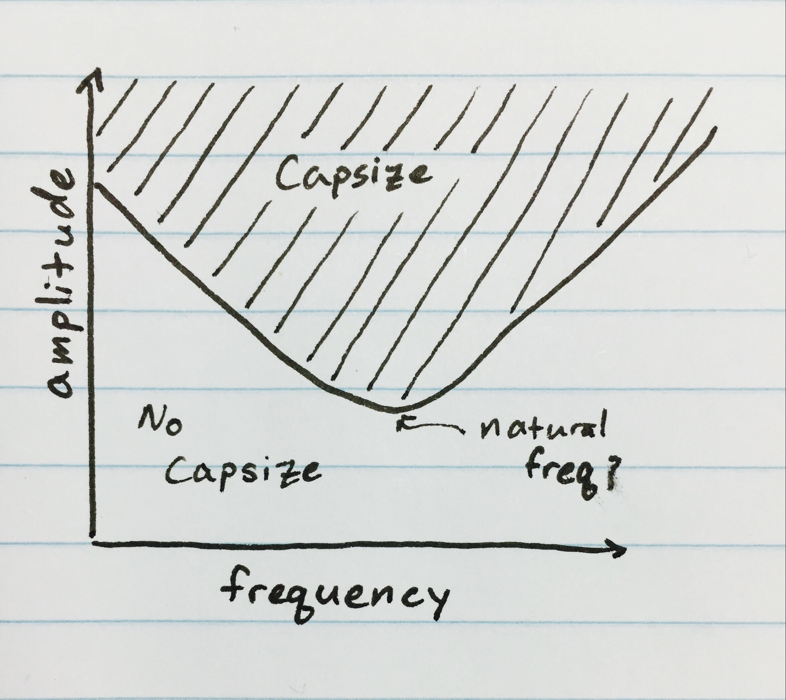

# The Fisherman's Fractal

Here is a fishing boat in the ocean. There is a large fish strapped to the side.

  
`[Figure 1]`

  
<b>Figure 1</b> - A fishing ship tossing in the ocean

When the waves are too big they capsize the ship

  
`[Figure 2]`

  
<b>Figure 2</b> - Large waves capsize the ship

When the waves are small but have the right frequency they push the ship farther and farther until it capsizes.

  
`[Figure 3]`

  
<b>Figure 3</b> - Small, resonant waves gradually capsize the ship

This seems to be a very simple system. Waves which closely match the ship's natural frequency capsize the ship easily. Large waves capsize the ship regardless of frequency. This naturally leads to two questions:

1. What is the natural frequency of the ship?
1. How big do waves of a particular frequency have to be to capsize the ship?

To answer these questions we will start by sketching a graph. We assume that, given some frequency, there is a minimum wave amplitude which will cause our ship to capsize. Above that amplitude the waves will always capsize the ship; below it they won't.

  

  
<b>Figure 4</b> - Region of capsize; the shaded region represents wave frequencies and amplitudes that inevitably lead to capsize

To answer our 2 questions we will attempt to find the boundary between the regions of "capsize" and "no capsize."

Normally we look to the equations of motion to solve for this boundary. However, in this case our set of equations is non-linear. We can't solve for the boundary directly.

  

    `\ddot{x} = -\beta\dot{x}-(x-x^{2})+F \sin(\omega t)`
  

  

    <b>Equation 1</b> - Equations of motion. *β* is the damping coefficient, *F* is the wave amplitude, and *ω* is the wave frequency
  

We will try to find the natural frequency by running some simulations. The interactive graph below contains 25 such simulations. Each ship starts at rest and is rocked by waves of different amplitudes and frequencies. Try flipping between the different display modes.

  
`[Figure 5]`

  
<b>Figure 5</b> - 25 ship stability simulations. In "ship" mode the ship is shown tossing back and forth in the ocean. In "color" mode the phase of the ship is represented by a shade of gray: dark means tipping to the left, light means tipping to the right.

The simulation results are a bit peculiar:

* As we expected, the ship seems to respond to one frequency more than others
* Waves with large amplitudes tend to capsize the ship, but not as quickly as we expect
* **One of the ships that we expect to capsize never does!**

What happened in the 4th column? The 1st and 3rd ships from the top capsized but the 2nd did not. This means one of our assumptions is wrong. **Sometimes larger waves prevent a ship from capsizing**.

We must run more simulations to get a clearer picture of the behavior of ship in different conditions. Here is a 64-ship simulation

  
`[Figure 6]`

  
<b>Figure 6</b> - 64 ship stability simulations. For performance reasons we can only view the phase of the ship using colors.

Is the boundary between "capsize" and "no capsize" regions simple?

  
`[Figure 7]`

  
<b>Figure 7</b> - 256 ship stability simulations

As we run more simulations we see that the boundary is not simple. It is surprisingly complex.

  
`[Figure 8]`

  
<b>Figure 8</b> - 262,144 ship stability simulations

